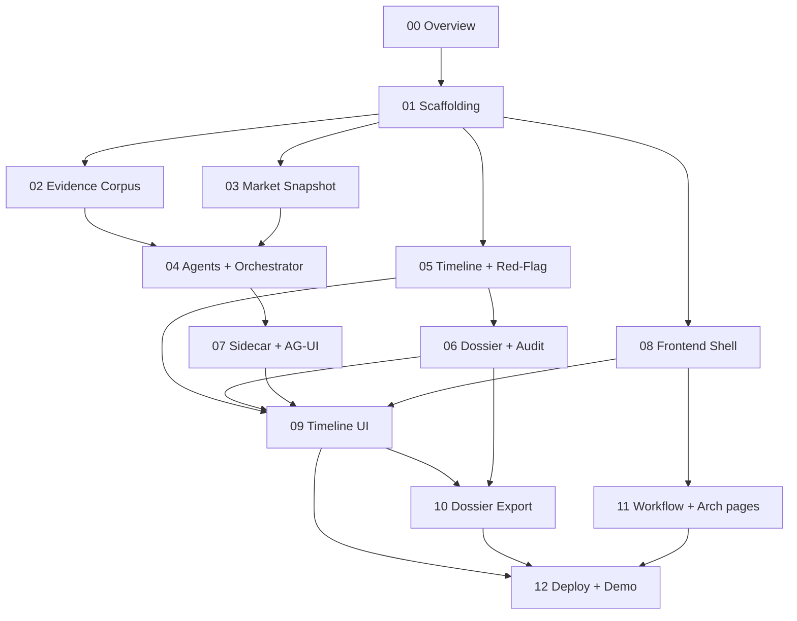

# Plan 00 — Overview, Sequencing & Prerequisites

**Project:** Rewind — The Decision Black Box Recorder
**Date:** 2026-07-06
**Sources:** `RequirementDefinition.pdf`, `HACKATHON-FINDINGS.md`, adversarial reviews in `.copilot-tracking/reviews/2026-07-06/`

---

## 1. What we are building

A flight recorder for investment decisions. Compliance types a position + date ("On 14 Mar 2025 the
firm added NordStar Industrials the day before its downgrade — reconstruct the decision, prove no
MNPI") and AI agents rebuild a regulator-ready **who-knew-what-when** dossier in ~90 seconds instead
of ~3 weeks of email archaeology.

- **Two timeline lanes:** what the firm *privately* knew (vault) vs what the market *publicly* knew
  (as-of FRED/Treasury + publication-stamped news). The information gap **is** the compliance finding.
- **The money moment:** the Gap & Red-Flag agent finds "the risk approval was signed 6 hours BEFORE
  the valuation model it cites was last edited." This is a **deterministic C# timestamp rule**
  (`approvalTs < modelEditedTs`), not LLM insight — reproducible on stage.
- **Non-negotiables:** never recommends / scores / gates a trade; looks strictly backward. No buy/sell
  language anywhere. Timeline ordering and every red-flag trigger are deterministic C#; the LLM only
  narrates and cites.

## 2. Confirmed decisions (from planning Q&A)

| Decision | Choice |
|---|---|
| Backend | **C# / ASP.NET Core (.NET 9)** + Microsoft Agent Framework over Azure AI Foundry |
| Scope | **Full 5-day build** (cut-lines documented per plan) |
| Azure infra | **Assume resources exist / provisioned manually**; plans document required env vars + RBAC (no IaC authoring plan) |
| Adversarial fixes | **Fold all must-fixes** from the three reviews into the relevant plans |

> The Python files under `backend/app/` are an **abandoned prototype** (only stale `__pycache__`
> remains). The real reference code lives in `templates/`. New C# code targets
> `backend/FinancialServices.Api/`.

## 3. The plan set

Each plan is a focused, independently trackable work package. Complete them roughly in order;
the dependency graph below shows what can run in parallel.

| # | Plan | Primary day | Depends on |
|---|---|---|---|
| 00 | Overview, Sequencing & Prerequisites (this file) | 0 | — |
| 01 | [Solution Scaffolding & Configuration](01-solution-scaffolding.md) | 0 | 00 |
| 02 | [Synthetic Evidence Corpus & AI Search Index](02-evidence-corpus-and-search.md) | 1 | 01 |
| 03 | [Market Snapshot Reconstructor (as-of, deterministic)](03-market-snapshot-reconstructor.md) | 1 | 01 |
| 04 | [Agents & Reconstruction Orchestrator (AG-UI)](04-agents-and-orchestrator.md) | 2 | 01, 02, 03 |
| 05 | [Timeline Assembler & Red-Flag Rules (deterministic C#)](05-timeline-and-redflag-rules.md) | 2 | 01 |
| 06 | [Dossier, Cosmos Persistence & Audit Trail](06-dossier-persistence-and-audit.md) | 2 | 01, 05 |
| 07 | [CopilotKit Node Sidecar & AG-UI Wiring](07-copilot-sidecar-and-agui.md) | 2 | 01, 04 |
| 08 | [Frontend Shell, Routing & Settings](08-frontend-shell-and-settings.md) | 1 | 01 |
| 09 | [Two-Lane Black-Box Timeline UI](09-timeline-ui.md) | 3 | 05, 06, 07, 08 |
| 10 | [Dossier Export (PDF)](10-dossier-export.md) | 4 | 06, 09 |
| 11 | [Workflow & Architecture Pages (mandatory)](11-workflow-and-architecture-pages.md) | 3 | 08 |
| 12 | [Deployment, Observability & Demo Readiness](12-deployment-and-demo.md) | 4–5 | all |

### Dependency graph



## 4. Day-by-day mapping (from the build plan)

| Day | Deliverable | Plans |
|---|---|---|
| 0 (½) | Gates cleared + skeleton streaming locally | 00, 01, (07 vanilla) |
| 1 | Evidence corpus authored + indexed; C# as-of FRED filter; React shell | 02, 03, 08 |
| 2 | All agents end-to-end in console: dossier object + red flag firing | 04, 05, 06, 07 |
| 3 | **Timeline UI (the big investment):** two lanes, streaming cards, red-arrow, scope gate | 09, 11 |
| 4 | Dossier export (pre-rendered fallback mandatory) + all-green control + Cosmos audit + deploy | 10, 06, 12 |
| 5 | Polish, severity-ranked flags, rehearse 3× | 12 |

## 5. Cut-lines (drop in this order if behind)

1. Live PDF export → pre-rendered dossier PDF opened on click (the timeline stays live) — Plan 10
2. Restricted-list / MNPI-proximity flag → keep only the timestamp gotcha + hindsight-note flags — Plan 05
3. All-green control decision → narrate it instead of running it — Plan 12
4. Azure deploy → demo from localhost against live Foundry + AI Search — Plan 12

**Guaranteed-demoable core:** Vault Forensics + deterministic timeline + the one timestamp red flag,
streamed as agent cards. That alone lands the story and every hard constraint (Plans 01, 02, 04, 05,
07, 08, 09).

## 6. Prerequisites — do BEFORE writing code (manual, infra assumed provisioned)

These gate deployment and have external lead time. Since infra is provisioned manually, treat this as
a checklist rather than an IaC plan.

- [ ] **GPT-5 access** registered at aka.ms/openai/gpt-5 (gates deployment; keep GPT-4.1 as fallback)
- [ ] `az login` for every teammate + **Entra-only** auth on the Foundry Projects client (no API key)
- [ ] Region chosen with Responses API + File Search + Code Interpreter coverage before provisioning
- [ ] Model quota (TPM) bump requested (multi-agent fan-out hits 429s on default quota)
- [ ] **RBAC assigned** (GUIDs, ~10 min propagation — "works locally, 403 in cloud" = wait):
  - `AIProjectClient` → **Foundry User** `53ca6127-db72-4b80-b1b0-d745d6d5456d`
  - `AzureOpenAIClient` → **Cognitive Services OpenAI User**
  - AI Search → **Search Index Data Reader** (query) / **Search Index Data Contributor** (index)
  - Cosmos DB → **Cosmos DB Built-in Data Contributor** (data plane)
  - Never assign `Azure AI Developer` (wrong product)
- [ ] Azure resources exist: **AI Foundry project**, **Azure OpenAI** deployment, **AI Search Basic**,
  **Cosmos DB free tier** (opt-in at creation), optional **Content Safety**, **App Insights**
- [ ] FRED API key obtained (fred.stlouisfed.org — free); Treasury FiscalData needs no key
- [ ] Prerelease AG-UI NuGet versions pinned day 0 (never upgrade mid-hackathon)

### Required environment variables (populate `.env` / user-secrets — never commit)

Backend API (`AZURE__*` bind to `AzureOptions`):

```
AZURE__AiProjectEndpoint=            # Foundry project endpoint
AZURE__AiProjectName=
AZURE__AgentModel=gpt-5              # fallback gpt-4.1
AZURE__OpenAiEndpoint=
AZURE__OpenAiApiVersion=2024-12-01-preview
AZURE__CosmosEndpoint=
AZURE__CosmosDatabase=rewind
AZURE__SearchEndpoint=
AZURE__SearchIndex=rewind-vault
AZURE__ContentSafetyEndpoint=
AZURE__OrchestratorAgentName=ReconstructionOrchestrator
AZURE__VaultForensicsAgentName=VaultForensics
AZURE__RedFlagAgentName=GapAndRedFlag
FRED_API_KEY=
APPLICATIONINSIGHTS_CONNECTION_STRING=
AzureAd__TenantId=
AzureAd__ClientId=
```

CopilotKit sidecar (`copilot-runtime/.env`):

```
PORT=4000
API_BASE_URL=http://localhost:8000
AZURE_OPENAI_ENDPOINT=
AZURE_OPENAI_DEPLOYMENT=
AZURE_OPENAI_API_VERSION=2024-12-01-preview
# Prefer DefaultAzureCredential/managed identity over AZURE_OPENAI_API_KEY (see Plan 07 hardening)
```

## 7. How to use these plans

- Work a plan top-to-bottom; check off `- [ ]` tasks as you complete them.
- Each plan lists **exact file paths**, **acceptance criteria**, and inline **⚠ Fix** callouts that
  reference the adversarial finding IDs (ARC-*, SEC-*, STK-*).
- Optionally run each through the RPI loop (`/fin-task-implement` with the **Fin Task Implementor**,
  then `/fin-task-review`). Update `.github/... TASKS.md` or this folder as you complete work.

## 8. Global guardrails (apply to every plan)

- **Real Azure services only** — no mocks/stubs/fake clients in runtime paths; fail loudly on missing
  config. Mocks allowed only in xUnit/vitest tests.
- **Determinism:** timeline ordering + red-flag triggers are plain C# in `Analysis/`; the LLM narrates
  and cites only. Show the rule on screen when a flag fires.
- **Language:** never say buy / sell / hold / recommend / allocate / trade / alpha / signal. Rewind
  reconciles data; it is not a trading agent. Narrate "observation-date filtering," never "point-in-time
  vintage data."
- **Security:** deny-by-default auth; object-level authorization on every read/mutation; durable
  immutable audit; treat all LLM tool arguments as hostile.
