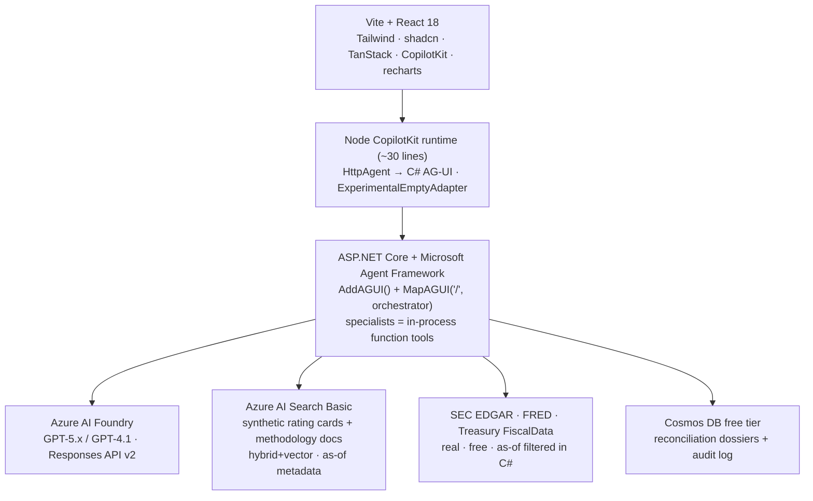

# Prism — Corporate Bond Credit-Rating Divergence Explainer
*Build plan · Capital Markets Hackathon · Data Providers pod · 2026-07-06*

> **One-liner:** Three data providers look at the same corporate bond and publish three
> different credit verdicts. **Prism** is an agent team that reconstructs each provider's
> reasoning, decomposes the divergence to the exact drivers, and tells you — with citations —
> which verdict you can trust and why.

This plan builds directly on the **Financial Services Copilot Kit** accelerator already in this
repo (`templates/csharp-api`, `templates/frontend-design-system`, `templates/workflow-visualization`)
and reuses the validated stack research in [HACKATHON-FINDINGS.md](HACKATHON-FINDINGS.md).

---

## 1. The concept

**Persona.** A **reference-data / credit-data analyst** at a data provider (or a buy-side credit
analyst who consumes multiple providers). When providers disagree on an issuer's creditworthiness,
their job is to figure out *why*, produce an auditable reconciliation, and flag which assessment is
stale or driven by outdated inputs.

**What Prism does.** Given one corporate-bond issuer and an as-of date, Prism:
1. Retrieves each provider's credit assessment (letter/score + factor breakdown + as-of date).
2. Grounds the issuer in **real** fundamentals (SEC EDGAR) and market context (FRED spreads / Treasury curve).
3. **Decomposes the notch gap** between providers into weighting / input / methodology buckets.
4. Fires **deterministic red flags** (stale input, missing coverage, outlier provider) with citations.
5. Emits a **reconciliation dossier** — every claim hyperlinked to a source row.

**Why it wins the rubric.** It is a data-provider-native problem (the providers' own products
disagree), it is instantly recognizable to a capital-markets audience, its "money moment" is a
**deterministic C# rule** (reproducible, not LLM luck), and it reuses the in-repo accelerator.

**Why it is not a trading agent.** Prism never says buy/sell/hold, never scores a trade, never
recommends an allocation. It explains **data disagreement** — a reference-data / data-quality
reconciliation capability. It looks at *why the data differs*, not at what to do with it.

---

## 2. The providers (business-accurate framing)

> **UPDATE (2026-07-06):** we have **live Moody's and Morningstar APIs**. Provider ratings now come
> from **real** rating agencies where entitled; Bloomberg is dropped (no hackathon-legal API). This
> is a strict upgrade to Business Accuracy (rubric #2) and to core principle P1 (real services).

| Provider | Source | Data | Style |
|---|---|---|---|
| **Moody's** | **Real API** (product TBC — see package 04) | Issuer/instrument rating + rating-action date | Analyst-committee + model |
| **Morningstar DBRS** | **Real API** (DBRS Morningstar — real NRSRO) | Letter rating (`A (low)`, `BBB (high)`) + action date | Analyst-committee + model |
| **MSCI** *(3rd slot)* | Synthetic, clearly labeled (unless MSCI entitlement confirmed) | Model-implied rating (`BBB-`) | Quant + sector/ESG overlay |

> **Honesty rule:** Moody's and DBRS values are **real** (from the APIs). The MSCI slot is
> **synthetic and clearly labeled** until entitlement is confirmed. Fundamentals underneath are real
> (SEC EDGAR, FRED). We **curate the demo by issuer *selection*** over real data — finding genuine
> split ratings and a genuinely not-yet-updated rating vs a recent filing — never by fabricating data.

**Split-rating framing:** Moody's vs DBRS disagreements are common and real; a two-provider split is a
valid, powerful demo even without the synthetic third.

---

## 3. The divergence drivers (what Prism decomposes)

A credit rating ≈ a weighted sum of factor scores. Divergence between two providers decomposes into:

1. **Weighting differences** — Provider A weights leverage (Debt/EBITDA) 35%; Provider B weights interest coverage 30%. Same inputs, different emphasis.
2. **Input / as-of differences** — Provider A's rating is as-of a date *before* the latest 10-Q; Provider B incorporated it → **stale-data flag** (deterministic).
3. **Methodology adjustments** — Provider B applies a sector / parent-support / ESG overlay that Provider A does not.
4. **Qualitative overlays** — analyst committee judgment vs a pure quantitative model.

The **Divergence Decomposer** (pure C#) attributes the *notch gap* to these buckets as a
**waterfall**; the LLM only narrates each bucket and cites the source row.

### The "money moment" (deterministic, reproducible)
> **"Moody's `Baa1` and DBRS's `A (low)` differ on this issuer. The stale check shows Moody's last
> rating action predates the issuer's latest 10-Q, filed six weeks ago showing deleveraging — so
> Moody's assessment hasn't incorporated the improvement."**

The stale flag fires from a deterministic rule — `provider.ratingActionDate < issuer.latestFilingDate`
— on **real** rating-action dates (from the APIs) vs **real** EDGAR filing dates — **not** LLM
insight. On click, show the rule + both source rows. Also demo an **all-agree control** issuer
(providers within 1 notch) → Prism must *confirm consensus*, not only find disagreement.

---

## 4. Agent architecture (C# / Microsoft Agent Framework)

Following the validated pattern in HACKATHON-FINDINGS: **expose ONE AG-UI orchestrator agent**;
run specialists as **in-process function tools** (each call → a live CopilotKit generative-UI card).
Do **not** bet the demo on prerelease .NET multi-agent *workflow* streaming (Python-only today).

| Agent | Job | Tools / data | Model |
|---|---|---|---|
| **Reconciliation Orchestrator** | Parse request, plan the sweep, own the confirm-scope gate, assemble the dossier. The AG-UI entry agent. | Specialists as function tools | `gpt-5` (medium reasoning) |
| **Provider Agent — Moody's** | Retrieve + explain Moody's rating in its own terms, with citations | Moody's API (via connector) + methodology | `gpt-5-mini` / `gpt-4.1-mini` |
| **Provider Agent — DBRS Morningstar** | Same, for the DBRS letter rating | Morningstar API (via connector) + methodology | `gpt-5-mini` / `gpt-4.1-mini` |
| **Provider Agent — MSCI** *(synthetic slot)* | Same, for the model-implied MSCI assessment | Azure AI Search (labeled-synthetic card) | `gpt-5-mini` / `gpt-4.1-mini` |
| **Fundamentals Grounding Agent** | Pull real issuer financials + market context, establish ground-truth inputs with as-of dates | SEC EDGAR company-facts + FRED + Treasury (real, as-of filtered in C#) | `gpt-4.1-mini` |
| **Divergence Decomposer** | Compute notch gaps per provider pair; attribute to weighting / input / adjustment buckets; emit chart structure | **Pure deterministic C# — no LLM** | — |
| **Freshness & Red-Flag Agent** | Run deterministic rules (stale input, missing coverage, methodology conflict, outlier), narrate each with a citation | C# rules pass + LLM narration | `gpt-5-mini` |
| **Coverage / Confidence Agent** *(optional)* | Report provider coverage, data completeness, overall reconciliation confidence | — | `gpt-4.1-mini` |

**Design rule:** notch math, ordering, and flag triggers are **deterministic C#**; the LLM only
narrates and cites. Render the rule on screen when a flag fires (defuses "you rigged the data").

**Human-in-the-loop gate:** before the sweep, the orchestrator pauses at a *confirm issuer +
as-of date + providers to include* gate — `ApprovalRequiredAIFunction` → CopilotKit
`renderAndWaitForResponse`. Reinforces the governed-agents story.

### The notch ladder (a real, defensible detail)
Providers use different scales (DBRS `A (low)`, S&P/Fitch `A-`, Moody's `A3`). Build a **canonical
1–21 numeric notch ladder** in C# that maps every scale to a common integer, so "3-notch gap" is
precise and auditable. This is standard rating-scale-mapping practice.

---

## 5. Technical architecture

**Deploy:** Azure Container Apps (API + Node runtime, same environment, `minReplicas: 1`,
~20s heartbeat); frontend on Static Web Apps Free or a container. Avoid App Service for SSE.

**Reuse the accelerator:**
- `templates/csharp-api` → ASP.NET API + CopilotKit Node sidecar.
- `templates/frontend-design-system` → shadcn dark theme + providers.
- `templates/workflow-visualization` → add a **"Rating Reconciliation Pipeline"** tab.

**Key NuGet:** `Microsoft.Agents.AI` (GA); `Microsoft.Agents.AI.Hosting.AGUI.AspNetCore` +
`Microsoft.Agents.AI.Foundry` (**prerelease — pin exact versions day 0**); `Azure.AI.Projects` 2.x;
`Azure.Identity`; `Microsoft.Azure.Cosmos`; `Azure.Search.Documents`.

---

## 6. Data model

### Synthetic corpus (Azure AI Search, ~30–50 curated docs — curation beats volume)
- **Provider rating cards** — for each issuer × 3 providers: letter/score, as-of date, and a
  **factor breakdown** (leverage, interest coverage, profitability, liquidity, business/sector risk,
  overlay), each factor with its **weight + sub-score**, plus methodology notes. Every doc carries
  `provider`, `issuerId`, `asOfDate` metadata.
- **Methodology docs** — one short doc per provider stating its factor weights + adjustments (so
  agents can cite *"per DBRS methodology, leverage weight 35%"*).

### Real data (free, C# as-of filtered)
- **SEC EDGAR** company-facts API → Debt, EBITDA, interest expense, cash + **filing dates** (ground truth).
- **FRED** ICE BofA OAS indices (IG `BAMLC0A0CM`, HY `BAMLH0A0HYM2`, sector spreads) + **Treasury** par curve → market context / implied-spread sanity check.

### Cosmos DB
- `rating_reconciliations` (partition key `/issuerId`) — dossiers.
- `audit_events` — one entry per consequential action (scope confirmed, dossier exported).

### Issuer cast (~5–6 synthetic issuers with distinct personalities)
1. **Stale-provider divergence** — the money-moment issuer (one provider pre-latest-filing).
2. **Methodology-overlay divergence** — ESG/sector adjustment gap.
3. **Consensus / control** — all three within 1 notch (system must exonerate).
4. **Fallen-angel boundary** — sits on the IG/HY line (makes "one notch matters" visceral).
5. **Thin-coverage** — one provider has no rating (coverage/confidence flag).

---

## 7. Frontend

- **Issuer picker** → confirm-scope gate.
- **Divergence board** — three provider verdict cards (letter + as-of + confidence) side by side, notch gap highlighted.
- **Decomposition waterfall** (recharts) — the notch gap between two selected providers attributed to weighting / input / adjustment buckets.
- **Evidence stream** — CopilotKit generative-UI cards as agents run.
- **Red-flag banner** → click-through to the deterministic rule + both source rows.
- **Reconciliation dossier** — paginated export, every claim hyperlinked. **Pre-rendered PDF fallback mandatory.**
- **Workflow page tab** — "Rating Reconciliation Pipeline": orchestrator, 3 provider agents, fundamentals, decomposer, red-flag, gate, outcome — each with a populated detail panel.

Standards: dark theme via shadcn tokens (`bg-background`, `bg-card`, `text-muted-foreground`),
`lucide-react` icons, TanStack Query for all server state, TanStack Table for the factor grid.

---

## 8. Three-minute demo script

| Time | Beat |
|---|---|
| 0:00–0:20 | Analyst enters **NordStar Industrials** + as-of date. Three verdicts appear: DBRS `A (low)`, Bloomberg `BBB+`, MSCI `BBB-` — a **3-notch split**. "Which do you trust?" |
| 0:20–0:35 | Human **confirm-scope gate** (governed agents on display). |
| 0:35–1:15 | Provider agents stream reasoning cards; Fundamentals agent pulls **real EDGAR** financials + **FRED** spread context. |
| 1:15–1:45 | **Decomposition waterfall** assembles: the 3-notch gap = leverage (2) + sector overlay (1). |
| 1:45–2:15 | **RED FLAG** — MSCI's leverage input is pre-Q3; issuer deleveraged in Q3 (filed 6 weeks ago). Click → deterministic rule + EDGAR filing date + MSCI as-of date. "MSCI is stale." |
| 2:15–2:35 | **Control issuer** — all three within 1 notch → "consensus, high confidence." |
| 2:35–3:00 | Export the **reconciliation dossier** (every claim hyperlinked). |

---

## 9. Rubric mapping

| Criterion | How Prism scores |
|---|---|
| **01 Storytelling** | "One bond, three verdicts — which do you trust?" + the stale-data red-flag reveal |
| **02 Business accuracy** | Split ratings is textbook fixed income; accurate provider framing (DBRS NRSRO, Bloomberg DRSK, MSCI analytics); real EDGAR/FRED grounding |
| **03 Agentic design** | Orchestrator + 3 provider agents + fundamentals + deterministic decomposer + red-flag, visible via CopilotKit cards, with a HITL gate |
| **04 Technical feasibility** | Deterministic core; synthetic + real data; deploys to ACA; a "rating reconciliation" product line every provider could ship |
| **05 Creativity & reuse** | Novel framing (nobody builds rating-reconciliation copilots); builds directly on the in-repo FinCopilotKit accelerator |
| **06 Teamwork** | Clean 3–4-person split: data/corpus · C# agents · React/viz · demo/story |

---

## 10. Build plan (day-by-day)

| Day | Deliverable |
|---|---|
| **0 (½)** | Clear Foundry/GPT-5 gates; `az login` + `Foundry User` RBAC; pick region (Responses API + File Search); pin prerelease AG-UI NuGet; `azd up` skeleton from the accelerator |
| **1** | Author + index synthetic provider rating cards & methodology docs; C# EDGAR/FRED as-of fetchers; build the notch ladder; React shell + provider verdict cards |
| **2** | All agents end-to-end **in console** → reconciliation dossier object + red flag firing deterministically |
| **3** | **The viz (the big investment)** — divergence board + decomposition waterfall + streaming evidence cards + scope gate + red-flag click-through |
| **4** | Dossier export (pre-rendered PDF fallback) + consensus control issuer + Cosmos audit + `azd up` deploy |
| **5** | Polish, severity-ranked flags, rehearse 3× |

---

## 11. Day-0 checklist (external lead time — do first)

- [ ] Register GPT-5 access: aka.ms/openai/gpt-5 (keep GPT-4.1 fallback)
- [ ] `az login` for every teammate + `Foundry User` RBAC on the project
- [ ] Pick a region with Responses API + File Search + Code Interpreter
- [ ] Request a model-quota (TPM) bump (multi-agent fan-out hits 429s fast; chatty agents on `gpt-4.1-mini`)
- [ ] Pin prerelease AG-UI NuGet versions
- [ ] Clone the CopilotKit `.NET` example + `Azure-Samples/ai-chat-quickstart-csharp`; hello-world `azd up`

---

## 12. Risks & cut lines

**Risks**
- Waterfall illegible in 90s → Day 3 is dedicated to the viz; keep it to ≤4 buckets.
- "Rigged data" skepticism → show the deterministic rule on flag + demo the consensus control.
- Provider-methodology accuracy → label all ratings synthetic; cite methodology docs; frame values as *style-modeled*.
- Notch mapping across scales → canonical C# notch ladder (real practice), unit-tested.
- SSE buffering → deploy on ACA, not App Service.

**Cut lines (in order)**
1. Live PDF → pre-rendered PDF.
2. Coverage/Confidence agent → fold into the red-flag agent.
3. Extra issuers → keep 3 (stale-divergence, overlay-divergence, consensus).
4. Azure deploy → localhost against **live Foundry** (models must still be Foundry-hosted).

---

## 13. Language for the pitch (say / never-say)

**Say:** reconciliation, divergence, provenance, as-of correctness, coverage, notch gap, data quality,
methodology attribution, auditable, cited.

**Never say:** buy / sell / hold, recommend, allocate, trade, position sizing, alpha, signal. Prism
explains *why the data disagrees* — it does not tell anyone what to do with the bond.
