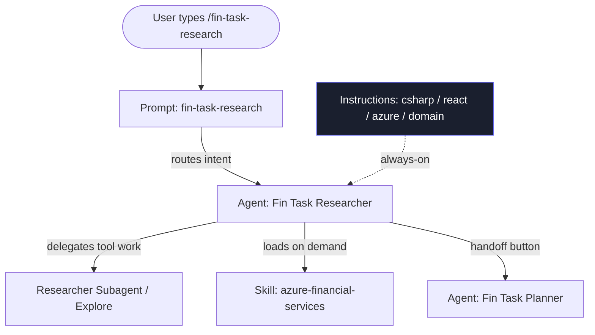
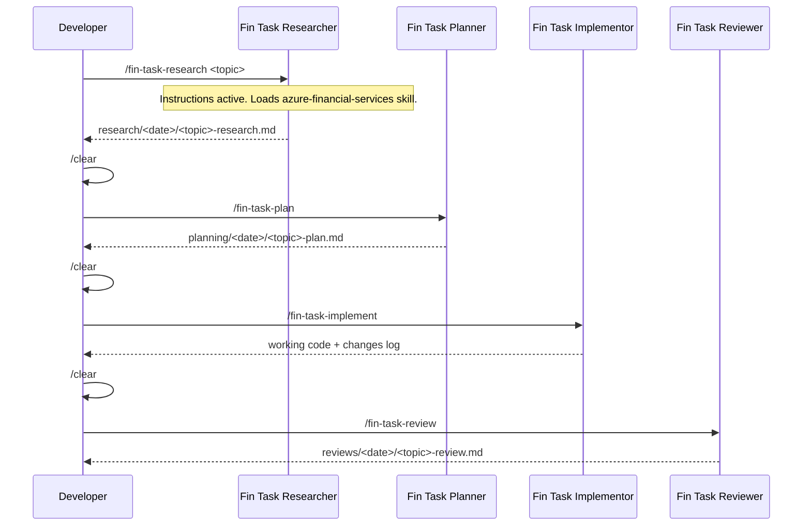

<!-- markdownlint-disable-file -->
# Understanding the Financial Services Copilot Kit

> **Internal reference — not shipped in the package.**
> This is a teaching document. Use it to explain to colleagues *what* the kit is,
> *how* its pieces work alone and together, *why* it is built this way, and *how* to
> change its behavior — including how to steer the very first "Research" step toward
> one technology choice over another (e.g. Microsoft Agent Framework vs direct async .NET).
>
> Conceptual foundations are adapted from Microsoft HVE Core:
> - [AI Artifacts Architecture](https://github.com/microsoft/hve-core/blob/main/docs/architecture/ai-artifacts.md)
> - [Architecture Overview](https://github.com/microsoft/hve-core/blob/main/docs/architecture/README.md)
> - [Build Workflows](https://github.com/microsoft/hve-core/blob/main/docs/architecture/workflows.md)

---

## 1. The one-paragraph mental model

GitHub Copilot, out of the box, is a smart generalist. This kit turns it into a
**disciplined team of financial-software specialists** by adding four kinds of
customization files. Think of it as hiring and onboarding a team:

- **Instructions** are the *employee handbook* — always-on rules everyone follows.
- **Prompts** are the *job tickets* — the repeatable requests that kick off work.
- **Agents** are the *specialists* — each person with one role and clear boundaries.
- **Skills** are the *reference binders on the shelf* — deep knowledge pulled down only
  when a task needs it.

None of these are magic. They are just Markdown files with a small YAML header. What
makes them powerful is *when* and *how* Copilot loads them, and how they hand work to
each other. That delegation chain is the whole point.

---

## 2. The four artifact types, one at a time

HVE Core calls this a **four-tier artifact system**. Each tier answers a different
question:

| Artifact | File | Answers the question… | Trigger | Lifetime in context |
|---|---|---|---|---|
| **Instruction** | `*.instructions.md` | "What standards apply here?" | Auto, when an open/edited file matches its `applyTo` glob | Always-on for matching files |
| **Prompt** | `*.prompt.md` | "What does the user want to do?" | User types `/command` | One message (the launch) |
| **Agent** | `*.agent.md` | "How should this task be executed?" | A prompt routes to it, or the user picks it | The whole conversation |
| **Skill** | `SKILL.md` | "What deep knowledge/utility does this need?" | Loaded on demand when its `description` matches the task | Only while relevant |

### 2.1 Instructions — the always-on handbook

```markdown
---
description: "C# backend coding standards for ASP.NET Core financial services"
applyTo: "**/*.cs"
---
# C# Backend Standards
- Use record DTOs with validation attributes for all request/response bodies
- All Azure SDK calls use async clients and DefaultAzureCredential
- Never log full account numbers — mask as ****1234
```

- **How it fires:** automatically. The moment you work on a `.cs` file, this file's
  rules are injected into Copilot's context *before you even type a message*.
- **Composability:** multiple instruction files stack. A `.tsx` file can simultaneously
  pull in `react-frontend`, `azure-services`, and the catch-all `financial-domain`
  (which uses `applyTo: "**"`).
- **Our kit has four:** `csharp-backend` (`**/*.cs`), `react-frontend` (`**/*.tsx, **/*.ts`),
  `azure-services` (`**/*.cs, **/*.ts, **/*.tsx`), and `financial-domain` (`**`).
- **Why it matters:** this is the *quality floor*. The model literally cannot "forget"
  to mask account numbers or to use async Cosmos clients, because the rule is present
  on every relevant turn.
- **Cost:** they consume context tokens on every matching turn — so keep each one
  focused and narrow the `applyTo` glob. A bloated instruction file taxes every request.

### 2.2 Prompts — the reusable job ticket

```markdown
---
mode: agent
description: "Start financial domain research for a new feature or architectural decision"
---
# Financial Domain Research
**Topic:** $TOPIC
Produce a research document at .copilot-tracking/research/...
```

- **How it fires:** the user types `/fin-task-research credit risk scoring`. The
  `description` is the text shown in the `/` palette. `$TOPIC` (or `${input:topic}`)
  is filled at invocation.
- **A prompt is *not* an agent.** It carries no persona and no tools — it is a saved,
  parameterized opening message. In HVE Core terms, a prompt **captures user intent and
  routes it to an agent**. (HVE prompts can name the target agent with `agent:` in
  frontmatter; our kit pairs each prompt with an agent of the same name by convention.)
- **Why it matters:** consistency. Everyone on the team launches "research" the exact
  same way, producing the exact same artifact in the exact same place. No two engineers
  improvise the first move differently.

### 2.3 Agents — the bounded specialist

```yaml
---
name: Fin Task Researcher
description: "Financial domain research specialist for Azure-first solutions"
agents:                       # subagents it may delegate tool work to
  - Researcher Subagent
  - Explore
handoffs:                     # buttons that appear after it responds
  - label: "📋 Create Plan"
    agent: Fin Task Planner
    prompt: /fin-task-plan
    send: true                # fires the prompt automatically on click
---
# Fin Task Researcher
## Purpose … ## Core Principles … ## Must Not Do …
```

- **The body of the file is the system prompt** — the persona's role, principles, and
  hard boundaries.
- **`agents:`** lists subagents it can call to do the actual tool work (web search, code
  reading). This keeps the lead agent's context clean — the heavy searching happens in a
  sandbox and only the conclusion comes back.
- **`handoffs:`** are the chrome buttons in the Copilot panel. Clicking one switches to
  another agent and (if `send: true`) auto-fires a prompt. This is how the assembly line
  advances: Researcher → Planner → Implementor → Reviewer.
- **Why one job each?** Narrow scope produces better output. The Researcher is *forbidden*
  from writing application code; it may only create files under
  `.copilot-tracking/research/`. The Implementor is the only one that touches `backend/`
  and `frontend/`. Boundaries prevent a single over-eager turn from researching,
  planning, and half-implementing all at once.

### 2.4 Skills — the just-in-time binder

```markdown
---
name: azure-financial-services
description: "Azure agent patterns, model assignments, Cosmos schemas for finance.
Use when building agents, choosing models, or designing data persistence."
---
# Azure Financial Services Patterns
## Model assignments … ## Cosmos schemas … ## Agent patterns …
```

- **How it fires:** lazily. Copilot's skill matcher reads the `description` and pulls the
  skill in only when the active task semantically matches. You can also tell an agent to
  load one by name.
- **Why separate from instructions?** Instructions are *always-on and lightweight*; skills
  are *on-demand and heavy*. A 17 KB implementation guide full of Cosmos schemas and SDK
  examples would waste context if it were always present. As a skill, it loads only when
  someone is actually building an agent or designing persistence.
- **HVE Core nuance:** in HVE Core, skills often include *executable scripts* (`.sh` /
  `.ps1`) — "active execution," not just "passive reference." Our two kit skills
  (`azure-financial-services`, `workflow-visualization`) are knowledge-only, but the same
  mechanism supports shipping runnable utilities if we ever need them.

---

## 3. How they work *together* — the delegation chain

This is the part to emphasize when teaching. The artifacts are not four independent
features; they form a **delegation hierarchy**. HVE Core describes the flow as:

> User invokes a **prompt** → prompt routes to an **agent** → agent executes with
> **instructions** auto-applied by file context → agent pulls in **skills** for deep
> knowledge or utilities.



Two complementary force directions are happening at once:

1. **Top-down (intent → execution):** the prompt expresses *what*, the agent decides
   *how*, the skill supplies *deep knowledge*.
2. **Cross-cutting (always present):** instructions inject *standards* into every turn
   regardless of which agent is active.

### 3.1 The RPI assembly line

The kit's headline workflow is **Research → Plan → Implement → Review (RPI)**. Each phase
is a different specialist agent, launched by its own prompt, producing a durable artifact
that the next phase consumes.



**Why `/clear` between phases?** Each specialist starts with a clean slate. The Planner
should read the *written research document*, not inherit the Researcher's half-formed
thoughts and dead ends from conversation memory. The artifact file — not the chat
history — is the hand-off contract. This is deliberate: it forces each phase to commit
its reasoning to a reviewable file.

### 3.2 Why the file artifacts matter

The `.copilot-tracking/` directory is the connective tissue:

```
.copilot-tracking/
├── research/<date>/   ← Researcher writes, Planner reads
├── planning/<date>/   ← Planner writes, Implementor reads
├── changes/<date>/    ← Implementor writes, Reviewer reads
└── reviews/<date>/    ← Reviewer writes, human reads
```

Each phase's output is a durable, version-controllable record. A weak research doc is
visible *before* any code is written, so you catch bad decisions when they are cheap to
fix.

---

## 4. Why build it this way? (Benefits to sell)

| Benefit | What delivers it |
|---|---|
| **Consistency** | Prompts make everyone start the same way; instructions enforce the same standards on every turn. |
| **Quality floor** | Always-on instructions mean security/compliance rules (PII masking, async clients, no mock data) can't be forgotten. |
| **Separation of concerns** | One agent = one job. No single turn researches, plans, and implements in a confused blur. |
| **Reviewability** | RPI writes durable artifacts. Bad decisions surface in the research doc, not in production code. |
| **Context efficiency** | Heavy reference material lives in skills (lazy-loaded), not instructions (always-on). Tokens spent where they matter. |
| **Domain encoding** | Financial regulations, terminology, and Azure-first patterns are baked in, so the model speaks the business's language by default. |
| **Onboarding** | A new engineer inherits the whole team's accumulated judgment the moment they install the extension. |
| **Reproducibility** | The same scenario run by two engineers produces structurally identical artifacts and code. |

---

## 5. How to change the kit's behavior

There are two distinct levers, and it's important colleagues understand the difference:

1. **Change the artifacts** — edit the rules/personas themselves. Permanent, applies to
   everyone, requires repackaging the extension.
2. **Steer at runtime** — phrase the Research prompt so the existing agents make the
   choice you want for *this* task. Immediate, no repackaging. (Section 6.)

### 5.1 Editing an instruction (a standard for everyone)

Edit the source file under `.github/instructions/...`. To add a rule, add a bullet. To
change a pattern, replace the code block. To narrow scope, tighten the `applyTo` glob.

> **Gotcha (from hard experience):** don't leave *conflicting* examples in an instruction
> file. If the top says "use design tokens" but a lower code snippet still uses off-theme
> colors, the model may follow the snippet. Keep examples consistent with the rules.

### 5.2 Editing an agent (a specialist's behavior)

The agent body is its system prompt. To sharpen it:

- Add to **Core Principles** to change *how* it works.
- Add to **Must Not Do** to stop scope creep (this is often more effective than adding
  "do" rules).
- Edit **handoffs** to change where the assembly line goes next.
- Edit the **`agents:`** list to grant/remove subagent tool access.

### 5.3 Editing a prompt (the launch ticket)

Keep prompts lean — let the agent body carry the heavy instructions. A good prompt names
the output path and the key questions, and nothing more. Avoid hardcoding
`agent: <Name>` unless that agent is actually registered, or the `/command` will refuse
to submit.

### 5.4 Editing or adding a skill (deep knowledge)

The `description` is the trigger — make it keyword-rich with the terms that appear when
the knowledge is needed. Put heavy reference material here (long tables, full SDK
examples) rather than in always-on instructions.

### 5.5 Re-packaging after any change

A file in `.github/` does **nothing** until it is registered in the extension's
`package.json` and rebuilt. VS Code does not auto-scan a dropped-in folder.

```powershell
# 1. Sync source → extension bundle
Copy-Item ".github\*"   "vscode-extension\.github\"   -Recurse -Force
Copy-Item "templates\*" "vscode-extension\templates\" -Recurse -Force

# 2. If you ADDED a file, register its path in vscode-extension/package.json:
#    chatInstructions / chatPromptFiles / chatAgents / chatSkills

# 3. Bump version, build, install
cd vscode-extension
npx @vscode/vsce package --no-dependencies --skip-license
code --install-extension fin-copilot-kit-X.Y.Z.vsix --force
# Then FULLY restart VS Code.
```

---

## 6. Steering the Research step toward "A vs B" (the key technique)

This is the question that prompted this guide: *how do I guide that initial Research
prompt so it chooses, say, Microsoft Agent Framework over hand-rolled async orchestration?*

There are **three levels of control**, from lightest to heaviest. Use the lightest one
that gets the job done.

### Level 1 — Decide in the prompt (per-task, recommended default)

The Researcher is built to "output ONE recommended approach per scenario." If you state
the choice in the `$TOPIC` string, it researches *that* path and verifies its specifics
instead of re-litigating the decision. The topic string is your steering wheel.

```
/fin-task-research credit risk scoring pipeline for corporate loans —
Microsoft Agent Framework orchestration (not hand-rolled async) —
Prompt Agents in Azure AI Foundry (not Hosted Agents) —
CosmosDB container "assessments" partition /company_id —
AI Search sanctions-pep index for KYC — loan officer HITL gate
```

Naming the decision *and the rejected alternative* ("MAF, not hand-rolled async") is the single
most reliable lever. The Researcher then verifies `dotnet add package Microsoft.Agents.AI`,
the correct namespaces, the checkpoint store, and the HITL pattern — rather than
spending effort comparing frameworks you've already chosen between.

**The recurring financial decision points** worth naming explicitly:

| Decision | Option A | Option B | Phrase to put in the prompt |
|---|---|---|---|
| Orchestration | Microsoft Agent Framework | Direct async .NET | "Microsoft Agent Framework orchestration (not hand-rolled async)" |
| Foundry agent type | Prompt Agent | Hosted Agent | "Prompt Agents (not Hosted Agents) — quota limits" |
| Vector search | Azure AI Search | Cosmos DB vector | "AI Search vector index for sanctions screening" |
| Grounding | Bing grounding | Private AI Search RAG | "Bing grounding for adverse media" |
| Transport | SignalR streaming | REST + polling | "real-time SignalR streaming" |

### Level 2 — Ask for a comparison first (when you're undecided)

If you genuinely don't know A vs B, ask the Researcher to *make* the decision with stated
criteria, then commit it to the doc:

```
/fin-task-research orchestration framework choice for a 3-agent loan pipeline —
compare Microsoft Agent Framework vs direct async .NET for: Azure-native auth, built-in
human-in-the-loop gates, CosmosDB checkpoint persistence, and team familiarity —
recommend ONE and justify, then design the pipeline around the winner
```

Because the Researcher cites real SDK facts (it uses documentation tools, not guesses),
its recommendation is grounded. You review the written rationale before planning begins.
The full decision matrices in §7.3 below are a useful checklist when reviewing what it
produces.

### Level 3 — Bake the default into an artifact (when the choice is a standing policy)

If "we always use Microsoft Agent Framework" is an organizational standard rather than a
per-project choice, encode it so nobody has to remember:

- **In the `azure-services` instruction** (always-on, applies everywhere):
  ```markdown
  ## Orchestration
  - Default to Microsoft Agent Framework (`Microsoft.Agents.AI`) for multi-agent
    orchestration, HITL gates, and Foundry integration.
  - Use hand-rolled async orchestration only for the simplest single/parallel-agent
    cases; justify in the research doc.
  ```
- **In the `azure-financial-services` skill** — add a "Framework selection" section with
  the decision matrix and verified import paths, so the deep guidance loads whenever an
  agent is being built.
- **In the Researcher agent's Core Principles** — add a tie-breaker line: *"When an
  orchestration framework is unspecified, default to Microsoft Agent Framework and note
  the assumption."*

After a Level-3 change, re-package (Section 5.5). Now even a bare
`/fin-task-research <topic>` trends toward the house default, while an explicit
per-prompt override (Level 1) still wins for the rare exception.

### Which level to use

```
One-off task, you know the answer         → Level 1 (say it in the prompt)
You're genuinely unsure                    → Level 2 (ask for a grounded comparison)
It's a standing policy for every project   → Level 3 (encode it, repackage)
```

---

## 7. Running the RPI workflow (operational guide)

Sections 1–6 explain *what the kit is* and *how to steer it*. This section is the
hands-on playbook for actually running a feature through Research → Plan → Implement →
Review for a real customer scenario.

### 7.1 The principle behind each phase

Each phase answers a different question:

| Phase | Question | Output |
|---|---|---|
| **Research** | What is true? What should we build and why? | A verified architecture decision with code examples |
| **Plan** | How exactly do we build it? What files, in what order? | A file-level checklist with no ambiguity |
| **Implement** | Execute the plan and verify it runs against real Azure | Working, styled, tested code |
| **Review** | Does it meet standards? Is anything missing or unsafe? | Graded findings + specific remediation |

The most important phase is **Research**. A weak research document leads to a plan full
of guesses, which leads to an implementation full of wrong patterns. Investing extra time
in the research prompt pays dividends across all subsequent phases.

### 7.2 Crafting a great research prompt

A research prompt should pack the domain problem, the key architectural choices, and the
constraints into one topic string:

```
/fin-task-research <topic>

WHERE:
  topic = domain problem + key architectural choices + constraints
```

**Anatomy of a good topic string:**

| Element | Example |
|---|---|
| Domain problem | "credit risk scoring for corporate loan applications" |
| Key decision(s) to resolve | "AI Search vector vs CosmosDB vector, MAF vs direct async .NET" |
| Agents needed | "CreditScoringAgent, KYCAgent with AI Search, NewsRiskAgent with Bing" |
| Persistence | "CosmosDB assessments container, partition by company_id" |
| Customer constraint | "must use Prompt Agents (not Hosted Agents) — Foundry quota limits" |
| Compliance | "AML/KYC screening, DSCR calculation, audit trail in CosmosDB" |

**Full example:**
```
/fin-task-research credit risk scoring pipeline for corporate loans —
three parallel agents (CreditScoring, KYCCheck with AI Search sanctions index,
NewsRisk with Bing grounding) — MAF orchestration — CosmosDB assessments container
(partition /company_id) — Prompt Agents not Hosted Agents — AML compliance —
loan officer human-in-the-loop gate before final decision
```

**What the Researcher should produce** (check the output doc for these):
- Recommended service for each component with rationale
- Exact SDK package name and version
- Verified API signatures (not guessed)
- Environment variables required
- Cosmos DB container schema + partition key choice
- Security and PII handling approach
- Workflow visualization nodes and connections
- Code examples for each major integration

### 7.3 Key architectural decision patterns

These are the recurring choice points in financial AI solutions. Encode the customer's
choice in the research prompt (§6) so the Researcher investigates the right path and the
Planner generates the right implementation tasks.

**Decision 1 — Orchestration: MAF workflow vs direct async vs single agent**

| | Microsoft Agent Framework (MAF) | Direct async .NET | Single-agent call |
|---|---|---|---|
| **Use when** | Multi-agent pipelines, HITL gates, Foundry integration, durable state | A few agents in parallel/sequence, no framework overhead | One agent, prototype, no orchestration complexity |
| **Azure fit** | Native: Foundry Agents, CosmosDB checkpoints, built-in HITL | Full control; `DefaultAzureCredential` + `Task.WhenAll` | Full control; best for the simplest scenarios |
| **State persistence** | Built-in checkpoint store (CosmosDB) | Bring your own | Not needed |
| **HITL gates** | First-class concept | Manual implementation | Manual implementation |
| **Prompt phrase** | "MAF orchestration" | "direct async .NET, Task.WhenAll, no orchestration framework" | "single Foundry agent call" |

> Specify `dotnet add package Microsoft.Agents.AI` (plus `Microsoft.Agents.AI.AzureAI` for the
> Foundry integration) so the Researcher verifies the correct namespaces and versions.

**Decision 2 — Foundry agent type: Prompt Agent vs Hosted Agent**

| | Prompt Agent | Hosted Agent |
|---|---|---|
| **Definition** | Agent defined by a system prompt string only; no persistent compute | Agent with compute, memory, optional code interpreter on Foundry |
| **Use when** | Most financial use cases: reasoning over text/data, no per-agent state | Need persistent memory across calls, code execution, file I/O in the agent |
| **Quota impact** | Low — shared compute pool | High — dedicated resources; often quota-limited |
| **SDK pattern** | `projectClient.GetAIAgentAsync("MyAgent")` then `RunAsync` | Same SDK; agent has hosted compute attached |
| **Prompt phrase** | "Prompt Agents (not Hosted Agents)" | "Hosted Agents with persistent memory" |

**Decision 3 — Vector search: Azure AI Search vs CosmosDB vector**

| | Azure AI Search (vector index) | CosmosDB vector search |
|---|---|---|
| **Use when** | Large corpus, semantic search over unstructured text (sanctions lists, filings) | Already on CosmosDB, vector similarity on existing containers, lower volume |
| **Indexing** | Separate pipeline; hybrid (keyword + vector) + semantic ranking | In-container; no separate pipeline |
| **Scale** | Millions of documents; advanced scoring | Thousands to low millions of items |
| **Financial use cases** | KYC sanctions screening, regulatory filings RAG, policy Q&A | Assessment history similarity, client profile matching, position embeddings |
| **Prompt phrase** | "AI Search vector index for sanctions/PEP screening" | "CosmosDB vector search for assessment history similarity" |

**Decision 4 — Cosmos DB schema and partition strategy**

Partition key choice is the single most consequential Cosmos DB decision. Wrong key =
expensive cross-partition queries at scale.

| Container | Typical partition key | Why |
|---|---|---|
| Credit assessments | `/company_id` | All queries scoped to a company |
| Client profiles | `/advisor_id` | Advisors query their own clients |
| Audit log | `/client_id` | Compliance queries per client |
| Meeting sessions | `/client_id` | Sessions belong to a client |
| Workflow checkpoints | `/workflow_id` | HITL gate state per workflow run |
| Portfolio proposals | `/client_id` | Portfolio queries per client |

In the prompt, specify the container name **and** the partition key candidate so the
Researcher can validate it against expected query patterns — e.g. "CosmosDB container
`assessments`, partition `/company_id`, queries filter by company and date range".

**Decision 5 — Grounding: Bing vs private index vs none**

| | Bing Grounding | AI Search RAG | No grounding |
|---|---|---|---|
| **Use when** | Market news, adverse media, current events | Private docs: policy, sanctions lists, internal data | Deterministic reasoning over provided data |
| **Financial use cases** | News risk, ESG screening, market commentary | KYC document search, claims forms, policy Q&A | Credit scoring from financials, DSCR calculation |
| **Prompt phrase** | "Bing grounding for adverse media" | "AI Search RAG over private sanctions index" | "no grounding — reason over submitted financials only" |

**Decision 6 — Real-time vs request/response**

| | WebSocket / SignalR (real-time) | REST (request/response) |
|---|---|---|
| **Use when** | Meeting transcription, live surveillance, streaming output | Loan assessment submit, portfolio run, batch report |
| **ASP.NET Core pattern** | SignalR hub `MapHub<TranscriptionHub>("/hubs/transcription")` | `[HttpPost("endpoint")]` controller action |
| **Prompt phrase** | "real-time SignalR streaming for live progress" | "REST API, async processing, job ID + polling" |

### 7.4 Research document structure (what to verify)

Use this as a checklist when reviewing research output before moving to planning:

```markdown
# Research: {Topic}

## Scope and Success Criteria        # what's in/out of scope, what "done" means
## Codebase Analysis                  # existing patterns, files to modify, auth patterns
## Architecture Decisions             # each decision + why; alternatives rejected + reason
## Azure Services                     # per service: SDK package+version, class, auth,
                                      #   async?, env vars, verified API signature
## Cosmos DB Schema (if applicable)   # container, partition key, document JSON, queries
## Agent Definitions                  # name, model, tools, system prompt outline, pattern
## Financial Domain                   # regulations, PII to mask, HITL gates, audit events
## Workflow Visualization Impact      # new nodes (type+color), connections, panel content
## Code Examples                      # one working example per major integration
```

### 7.5 Planning guidelines — what to demand from the Planner

After reviewing the research doc, run `/clear` then `/fin-task-plan`. A good plan has
these properties — send it back if any are missing:

1. **Every task references a file path** — not "implement the service" but
   "Create `backend/FinancialServices.Api/Services/CreditRiskService.cs`".
2. **Tasks in dependency order** — models before services, services before routers; types
   before components, components before pages.
3. **One action per task** — not "build the credit agent and add its route".
4. **The final phase is always the WorkflowPage update** — every plan ends with the
   workflow visualization.
5. **`.env` additions listed** — every new Azure service lists its required variables.
6. **Test tasks included** — at minimum one test per new service method and per new
   router endpoint.

### 7.6 Implementation checklist — verify before calling it done

Before handing to the Reviewer, verify these yourself:

```
□ Backend runs: dotnet run starts the API without error
□ Real Azure calls: all agents, Cosmos, AI Search calls go to live Azure (no mocks)
□ .env populated: every env var the feature uses has a real value
□ Endpoints respond: curl/Postman confirms API returns real Azure data
□ UI renders themed: dark background, Inter font, left sidebar visible
□ Workflow page updated: new nodes appear, clicking opens detail panel
□ Audit log: new financial operations appear in Cosmos auditLog container
□ HITL gates: if required, approval gates pause the workflow correctly
□ run-backend.bat, run-copilot-runtime.bat and run-frontend.bat start cleanly
```

### 7.7 Full end-to-end example sequence

**Scenario:** credit risk scoring pipeline for corporate loans — AI Search for KYC,
Cosmos DB for persistence, MAF orchestration, Prompt Agents.

1. **Research** (new conversation):
   ```
   /fin-task-research credit risk scoring pipeline for corporate loans —
   three parallel agents: CreditScoringAgent (gpt-4o, analyze financial statements),
   KYCCheckAgent (gpt-4o with AI Search sanctions-pep index), NewsRiskAgent (gpt-4.1
   with Bing grounding) — Microsoft Agent Framework orchestration — Prompt Agents in
   Azure AI Foundry (not Hosted Agents) — CosmosDB container "assessments" partition
   /company_id — loan officer HITL gate before final decision — AML compliance required
   — C# ASP.NET Core backend, React (shadcn) dark-theme frontend — .env must be populated for live testing
   ```
2. **Review the research doc** — confirm SDK packages/versions verified, AI Search index
   schema defined, Cosmos partition key validated, HITL gate placement confirmed, workflow
   nodes listed.
3. **Plan** — `/clear` then `/fin-task-plan`. Verify the plan ends with a WorkflowPage phase.
4. **Implement** — `/clear` then `/fin-task-implement`. If `.env` is empty, the Implementor
   lists exactly which variables to populate; populate them, confirm, then let it proceed.
5. **Review** — `/clear` then `/fin-task-review`. No Critical findings = ready to demo.

---

## 8. Quick reference

### File locations in the kit

```
.github/
├── copilot-instructions.md          # Root — always active
├── agents/
│   ├── fin-task-researcher.agent.md
│   ├── fin-task-planner.agent.md
│   ├── fin-task-implementor.agent.md
│   └── fin-task-reviewer.agent.md
├── instructions/
│   ├── coding-standards/
│   │   ├── csharp-backend.instructions.md    # applyTo: **/*.cs
│   │   ├── react-frontend.instructions.md   # applyTo: **/*.tsx, **/*.ts
│   │   └── azure-services.instructions.md   # applyTo: **/*.cs, **/*.ts, **/*.tsx
│   └── financial-domain/
│       └── financial-domain.instructions.md # applyTo: **
├── prompts/
│   ├── fin-task-research.prompt.md
│   ├── fin-task-plan.prompt.md
│   ├── fin-task-implement.prompt.md
│   ├── fin-task-review.prompt.md
│   └── scaffold-financial-app.prompt.md
└── skills/
    ├── azure-financial-services/SKILL.md
    └── workflow-visualization/SKILL.md

templates/frontend-design-system/    # copy-paste files for the exact UI look
.copilot-tracking/                   # created at runtime by the agents
├── research/YYYY-MM-DD/
├── planning/YYYY-MM-DD/
├── changes/YYYY-MM-DD/
└── reviews/YYYY-MM-DD/
```

### Common extension commands

```powershell
# Sync source → extension bundle
Copy-Item ".github\*"    "vscode-extension\.github\"  -Recurse -Force
Copy-Item "templates\*"  "vscode-extension\templates\" -Recurse -Force
Copy-Item "docs\*"       "vscode-extension\docs\"      -Recurse -Force

# Build (bump version in vscode-extension/package.json first)
cd vscode-extension
npx @vscode/vsce package --no-dependencies --skip-license

# Install, then fully restart VS Code
code --install-extension fin-copilot-kit-X.Y.Z.vsix --force
```

### Architecture decision cheat sheet

```
Orchestration:    MAF (Azure-native HITL) | direct async .NET (Task.WhenAll) | single agent (simplest)
Agent type:       Prompt Agent (most cases) | Hosted Agent (persistent memory/code exec)
Vector search:    AI Search (large corpus, hybrid) | Cosmos vector (small, same store)
Grounding:        Bing (news/markets) | AI Search RAG (private docs) | none (provided data)
Real-time:        WebSocket | REST + polling
Cosmos partition: /company_id · /client_id · /advisor_id · /workflow_id
Model selection:  gpt-4o (accuracy) | gpt-4.1 (reasoning) | o4-mini (speed/cost) | o1 (math)
```

---

## 9. Demoing the kit — "art of the possible" (for SEs and technical sellers)

This section is for technical sellers, solution engineers, and cloud architects who need
to show financial-services customers the art of the possible — and turn a business idea
into a working MVP while the customer watches.

> **The one-line pitch:** "Let me show you how we go from a whiteboard idea to a running,
> Azure-native financial app — with your standards baked in — in a single working session."

### 9.1 Why this lands with financial-services buyers

Financial customers are skeptical of demos that feel like vaporware. What they care about:

- **Regulation and risk** — can this be built compliantly (PII, audit, human-in-the-loop)?
- **Time to value** — how fast can we test an idea before committing budget?
- **Their stack** — does it fit our Azure estate, our standards, our controls?
- **Repeatability** — is this a one-off magic trick, or a way our team can actually work?

The kit answers all four *live*, because it bakes Azure, financial domain rules, and
engineering standards directly into the AI. You're not promising discipline — you're
**demonstrating** it.

### 9.2 The narrative arc (your demo story)

Structure every demo as a three-act story.

**Act 1 — "The problem you live with" (2 min).** Anchor on a real pain the customer just
described:
- *Capital Markets:* "Your analysts spend hours assembling portfolio risk summaries by hand."
- *Banking:* "Loan officers wait days for a credit decision that should take minutes."
- *Insurance:* "Claims triage is manual, inconsistent, and slow."

Then: *"Let's build a slice of the solution right now — together."*

**Act 2 — "Watch it get built" (10–15 min).** Drive the RPI workflow live
(`/fin-task-research` → `/fin-task-plan` → `/fin-task-implement` → `/fin-task-review`).
The customer sees a *disciplined process*, not a black box. Pause on the moments that
matter to them:
- When PII gets masked — *"That's your compliance team's rule, enforced by the AI."*
- When a human-in-the-loop gate appears — *"No trade, no payout, no decision executes
  without sign-off."*
- When the **Workflow page** renders — *"Your architects and auditors can see exactly how
  data flows."*

**Act 3 — "Now imagine this across your org" (3 min).** Zoom out — the point isn't this one
app, it's the **operating model**:
- *"Every developer builds this same way, to your standards, on day one."*
- *"Every feature comes with an audit trail, a workflow diagram, and a review."*
- *"And it improves every week as your team captures more patterns."*

### 9.3 The live demo script

Recommended scenario: **Loan Credit Risk Scoring** (banking) — visual, regulated,
universally understood.

| Step | What you type / show | What you say |
|---|---|---|
| 1 | `/fin-task-research a credit risk scoring service combining financial data, KYC, and news sentiment` | "First we *research* — the AI investigates Azure options and domain constraints before writing a line of code. Senior-engineer discipline, automated." |
| 2 | Show the research doc in `.copilot-tracking/research/` | "It picked Azure AI Foundry for the agents, Cosmos for persistence, and flagged the regulations that apply." |
| 3 | `/clear` then `/fin-task-plan` | "Now it turns research into a precise, file-level plan — including a mandatory workflow-visualization step." |
| 4 | `/clear` then `/fin-task-implement` | "Now it builds: a C# ASP.NET Core backend, three Azure agents, a React gauge UI — all to your coding standards." |
| 5 | Open the running app: **risk gauge** + **Workflow tab** | "Here's the working MVP. And here's the live data-flow diagram — click any node to see the code behind it." |
| 6 | `/clear` then `/fin-task-review` | "Finally it reviews its own work — flagging Critical, Major, or Minor issues, including compliance gaps." |

> **Pro tip:** Pre-run the scenario once so you know the timing, but run it *live* in the
> meeting. A recorded demo is a brochure; a live build is proof.

### 9.4 Discovery questions (to aim the demo)

Ask these early so you can tailor Act 1 and the scenario:

- "Walk me through a workflow your team wishes were faster."
- "What's a project you'd love to prototype but can't justify the build cost yet?"
- "What does 'compliant by default' need to mean for you — PII, audit, approvals?"
- "What's your current Azure footprint? Foundry, Cosmos, AI Search in play?"
- "Who needs to *see* how a system works — architects, auditors, regulators?"

### 9.5 Value props by audience

| Audience | What they care about | Your line |
|---|---|---|
| **CIO / CTO** | Speed, risk, talent leverage | "Your team ships faster *and* more consistently — juniors produce senior-quality work." |
| **Head of Engineering** | Standards, repeatability, onboarding | "Standards stop being a wiki nobody reads — they're enforced by the tooling automatically." |
| **Risk / Compliance** | Auditability, controls | "PII masking, audit trails, and human approval gates are built in, not bolted on." |
| **Line of Business** | Time to value, experimentation | "Test a business idea as a working prototype in a day, before committing real budget." |
| **Developers** | Less toil, more interesting work | "The boring, repetitive parts are automated; you focus on the hard, valuable problems." |

### 9.6 Handling common objections

| Objection | Response |
|---|---|
| *"AI-generated code isn't safe for regulated workloads."* | "Exactly why this kit enforces PII masking, audit logging, and human-in-the-loop gates automatically — and ends every feature with a review pass." |
| *"This only works for toy demos."* | "It's the same workflow your team uses for production. The standards and review aren't demo theater — they're the point." |
| *"We have our own coding standards."* | "Perfect — they become instruction files. The AI enforces *your* standards, not generic ones. Let's encode one right now." |
| *"Our developers will become dependent on it."* | "It's a force multiplier, not a crutch. It removes toil so engineers spend time on architecture and judgment." |
| *"How is this different from just using Copilot?"* | "Raw Copilot is individual autocomplete. This is an *operating model* — specialists, standards, and domain knowledge that compound across the whole team." |

### 9.7 The MVP-from-business-idea play

When a customer has a fuzzy business idea, use this to crystallize it into something they
can hold:

1. **Frame it** — restate their idea as a one-sentence feature.
2. **Research it live** — `/fin-task-research <their idea>` — show the AI exploring the space.
3. **Show the plan** — now the idea has shape: services, data, UI, workflow.
4. **Build a slice** — `/fin-task-implement` — produce a running vertical slice, not slideware.
5. **Make it theirs** — open the Workflow page; let them click through their own data flow.
6. **Hand them the next step** — "This is your MVP. From here it's a sprint, not a research
   project."

The emotional shift you're creating: *"This is real, this is fast, and this is safe."*

### 9.8 Leave-behinds and metrics

**Leave-behinds that keep momentum:**
- The **`.vsix`** so their team can install the same kit and reproduce the demo.
- The **`.copilot-tracking/` artifacts** from the live build — research, plan, review — as
  proof of rigor.
- A **one-pager** mapping their stated pain to the demoed capability.
- An offer: *"Give me your real coding standards and one real workflow — I'll come back with
  a tailored kit."*

**Metrics that make the business case:**
- **Cycle time** — idea → working prototype: weeks → a single session.
- **Onboarding** — new engineer productive: weeks → day one (standards are automatic).
- **Consistency** — % of features shipped with audit trail + review: variable → 100%.
- **Reuse** — every captured pattern benefits the whole team, compounding over time.

---

## 10. Teaching aids / FAQ for colleagues

**"Is a prompt the same as an agent?"**
No. A prompt is a saved opening message that *routes intent*. An agent is a persona with
tools and boundaries that *executes*. A prompt with no agent is just text; an agent with
no prompt still works (you can pick it directly).

**"Why don't the agents remember each other's conversations?"**
By design. `/clear` between RPI phases forces each specialist to rely on the written
artifact, not chat memory. The file is the contract.

**"Instruction vs skill — when do I use which?"**
Always-on + short + universal → instruction. On-demand + heavy + situational → skill.
If it would waste tokens on every turn, it's a skill.

**"I edited a `.github` file and nothing changed."**
It isn't registered/rebuilt. Sync to the extension bundle, ensure it's listed in
`package.json` contributions, rebuild the `.vsix`, reinstall, and fully restart VS Code.

**"How do I force a specific Azure or framework choice?"**
Section 6. Easiest: name it (and the rejected alternative) in the Research prompt.

**"What's the difference between this kit and plain Copilot?"**
Plain Copilot is a generalist with no memory of your standards, domain, or process. The
kit adds enforced standards (instructions), a repeatable process (prompts + RPI agents),
and deep domain knowledge (skills) — turning a generalist into a financial-software team.

---

## 11. Where to read more

- **Concepts in depth:** HVE Core
  [AI Artifacts Architecture](https://github.com/microsoft/hve-core/blob/main/docs/architecture/ai-artifacts.md)
  (the four-tier model, delegation flow, interface contracts).
- **System layout:** HVE Core
  [Architecture Overview](https://github.com/microsoft/hve-core/blob/main/docs/architecture/README.md).
- **CI/CD & packaging:** HVE Core
  [Build Workflows](https://github.com/microsoft/hve-core/blob/main/docs/architecture/workflows.md).
- **Adding new components (shipped doc):** [EXTENDING-THE-KIT.md](../docs/EXTENDING-THE-KIT.md)
  — the menu of ideas for new instructions, prompts, agents, and skills.
- **Quick start (shipped doc):** [README.md](../README.md).

> This document is the single internal reference: §1–6 are the *concepts* and how to
> steer them, §7–8 are the *operational* RPI playbook and quick reference, and §9 is the
> *demo / sell* talk track. It is intentionally kept out of the packaged extension.
